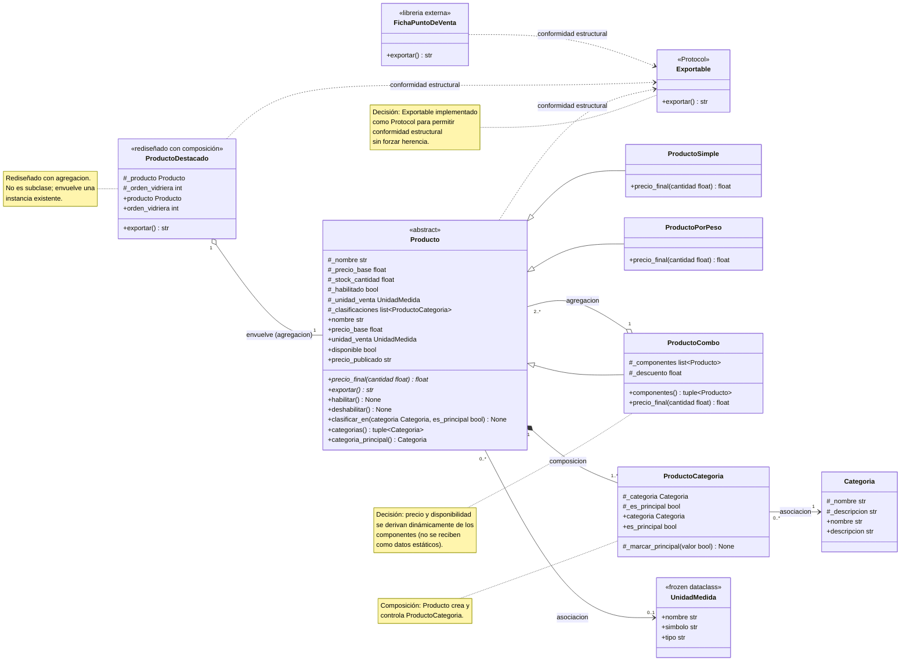

# UML en Mermaid

```mermaid
classDiagram
direction LR

class Exportable {
    <<Protocol>>
    +exportar() str
}

class Producto {
    <<abstract>>
    #_nombre str
    #_precio_base float
    #_stock_cantidad float
    #_habilitado bool
    #_unidad_venta UnidadMedida
    #_clasificaciones list~ProductoCategoria~
    +nombre str
    +precio_base float
    +unidad_venta UnidadMedida
    +disponible bool
    +precio_publicado str
    +precio_final(cantidad float)* float
    +exportar()* str
    +habilitar() None
    +deshabilitar() None
    +clasificar_en(categoria Categoria, es_principal bool) None
    +categorias() tuple~Categoria~
    +categoria_principal() Categoria
}

class ProductoSimple {
    +precio_final(cantidad float) float
}

class ProductoPorPeso {
    +precio_final(cantidad float) float
}

class ProductoCombo {
    #_componentes list~Producto~
    #_descuento float
    +componentes() tuple~Producto~
    +precio_final(cantidad float) float
}

class ProductoDestacado {
    <<rediseñado con composición>>
    #_producto Producto
    #_orden_vidriera int
    +producto Producto
    +orden_vidriera int
    +exportar() str
}

class ProductoCategoria {
    #_categoria Categoria
    #_es_principal bool
    +categoria Categoria
    +es_principal bool
    #_marcar_principal(valor bool) None
}

class Categoria {
    #_nombre str
    #_descripcion str
    +nombre str
    +descripcion str
}

class UnidadMedida {
    <<frozen dataclass>>
    +nombre str
    +simbolo str
    +tipo str
}

class FichaPuntoDeVenta {
    <<libreria externa>>
    +exportar() str
}

Producto <|-- ProductoSimple
Producto <|-- ProductoPorPeso
Producto <|-- ProductoCombo

Producto "1" *-- "1..*" ProductoCategoria : composicion
ProductoCombo "1" o-- "2..*" Producto : agregacion
Producto "0..*" --> "0..1" UnidadMedida : asociacion
ProductoCategoria "0..*" --> "1" Categoria : asociacion
ProductoDestacado "1" o-- "1" Producto : envuelve (agregacion)

Producto ..> Exportable : conformidad estructural
ProductoDestacado ..> Exportable : conformidad estructural
FichaPuntoDeVenta ..> Exportable : conformidad estructural

note for ProductoDestacado "Rediseñado con agregacion.<br>No es subclase; envuelve una<br>instancia existente."
note for ProductoCombo "Decisión: precio y disponibilidad<br>se derivan dinámicamente de los<br>componentes (no se reciben<br>como datos estáticos)."
note for ProductoCategoria "Composición: Producto crea y<br>controla ProductoCategoria.<br>"
note for Exportable "Decisión: Exportable implementado<br>como Protocol para permitir<br>conformidad estructural<br>sin forzar herencia."
```