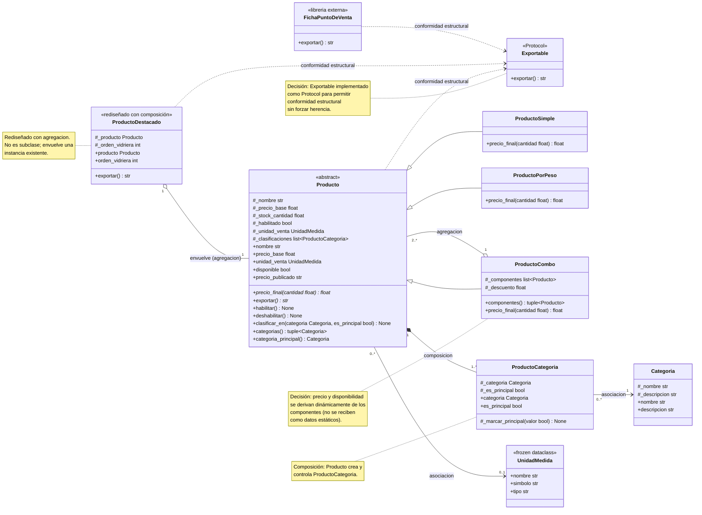

# 📦 FoodStore — Modelo de Productos  
README técnico con todas las decisiones tomadas hasta ahora

Este documento resume todas las decisiones de diseño, validaciones de dominio, justificaciones UML y reglas del PDF aplicadas al código actual del modelo de productos.

---

# 🧩 DomainError

```python
class DomainError(ValueError):
    pass
```

Motivo:
- El PDF exige “excepción de dominio” para reglas inválidas.
- Hereda de ValueError porque representa datos incorrectos del usuario o del negocio.
- Se usa en todas las validaciones específicas de cada tipo de producto.

---

# 🧩 UnidadMedida (Value Object)

```python
@dataclass(frozen=True)
class UnidadMedida:
    nombre: str
    simbolo: str
    tipo: str
```

Motivo:
- Es un Value Object: inmutable (frozen=True).
- Representa la unidad de venta (kg, g, L, unidad, etc.).
- No tiene lógica, solo datos.

---

# 🧩 Categoria (Entidad simple)

```python
class Categoria:
    def __init__(self, nombre: str, descripcion: str = "") -> None:
        if not nombre.strip():  # verifica si esta vacio o son solo espacios en blanco
            raise DomainError("El nombre de la categoría no puede estar vacío")
        self._nombre = nombre.strip()
        self._descripcion = descripcion

    # estos property evitan setters
    # Mantiene la inmutabilidad lógica de la categoría: una vez creada, su nombre y #descripción no cambian.
    @property
    def nombre(self) -> str:
        return self._nombre

    @property
    def descripcion(self) -> str:
        return self._descripcion

```

Motivo:
- El nombre no puede ser vacío → regla del dominio.
- Atributos privados + properties → inmutabilidad lógica.
- No tiene setters: una categoría no cambia una vez creada.


## ✔ Justificación de diseño
- **Inmutabilidad lógica**: una categoría es parte fija del catálogo; su nombre y descripción no cambian luego de creada.  
- **Sin setters**: evita inconsistencias y respeta el modelo del PDF (las categorías son entidades estáticas).  
- **Encapsulación**: los atributos internos (`_nombre`, `_descripcion`) quedan protegidos y solo se exponen mediante lectura.

## ✔ Qué hace cada property
- **`nombre`** → expone el nombre validado de la categoría.  
- **`descripcion`** → expone la descripción opcional.  
Ambos son **solo lectura**.


---

# 🧩 ProductoCategoria (Composición)


### ✔ Rol en el dominio
`ProductoCategoria` representa el **vínculo de composición** entre un `Producto` y una `Categoria`.  
El vínculo existe únicamente dentro del producto y es gestionado por él (no por el cliente).

```python
class ProductoCategoria:
    def __init__(
        self, producto: Producto, categoria: Categoria, es_principal: bool = False
    ) -> None:
        self._producto = (
            producto  # ! aca se crea la composicion Producto → ProductoCategoria
        )
        self._categoria = categoria
        self._es_principal = es_principal
```

### ✔ Atributos internos
- **`_producto`** → referencia al producto dueño del vínculo (composición).  
- **`_categoria`** → categoría asociada.  
- **`_es_principal`** → indica si esta categoría es la principal del producto.

```python
    @property
    def categoria(self) -> Categoria:
        return self._categoria

    @property
    def es_principal(self) -> bool:
        return self._es_principal
```

### ✔ Properties (solo lectura)
- **`categoria`** → expone la categoría asociada; el cliente puede consultarla pero no modificarla.  
- **`es_principal`** → indica si esta categoría es la principal; también es solo lectura.

```python
    def _marcar_principal(self, valor: bool) -> None:
        self._es_principal = valor
```

### ✔ Método interno
- **`_marcar_principal(valor)`** → usado exclusivamente por `Producto` para cambiar la categoría principal.  
  No está disponible para el cliente, preservando la integridad del vínculo.

### ✔ Justificación de diseño
- **Composición real**: el vínculo nace y muere con el producto.  
- **Inmutabilidad externa**: el cliente no puede alterar categorías ni marcar principal directamente.  
- **Encapsulación**: los atributos internos quedan protegidos; solo se exponen mediante lectura.  
- **Cumple el PDF**: la reclasificación se hace únicamente desde `Producto.clasificar_en()`.

### ✔ Línea que evidencia la composición

```python
self._producto = producto
```

---

# 🧩 Producto — Superclase abstracta del catálogo

### ✔ Rol en el dominio
`Producto` es la **superclase abstracta** que define el contrato común de todos los productos del catálogo.  
Incluye validaciones, atributos esenciales, clasificación en categorías y operaciones polimórficas como `precio_final` y `exportar`.

```python
class Producto(ABC):
    def __init__(..., categoria_principal: Categoria, ...) -> None:
        ...
        self._clasificaciones: list[ProductoCategoria] = []
        principal = ProductoCategoria(self, categoria_principal, es_principal=True)
        self._clasificaciones.append(principal)
```

### ✔ Atributos internos
- **`_nombre`** → nombre validado del producto.  
- **`_precio_base`** → precio base según el tipo de producto.  
- **`_stock_cantidad`** → cantidad disponible.  
- **`_habilitado`** → indica si el producto está activo.  
- **`_unidad_venta`** → unidad opcional (solo para productos por peso).  
- **`_clasificaciones`** → lista interna de `ProductoCategoria` (multiplicidad `*`).

### ✔ Properties públicos (solo lectura)

```python
@property  
def nombre(self) -> str: ...

@property  
def precio_base(self) -> float: ...

@property  
def unidad_venta(self) -> UnidadMedida | None: ...

@property  
def disponible(self) -> bool: ...

@property  
def precio_publicado(self) -> str: ...

@property  
def categorias(self) -> tuple[ProductoCategoria, ...]: ...

@property  
def categoria_principal(self) -> Categoria: ...
```

- **`nombre` / `precio_base` / `unidad_venta`** → exponen atributos esenciales.  
- **`disponible`** → habilitado y con stock mayor a cero.  
- **`precio_publicado`** → formato del precio para el catálogo.  
- **`categorias`** → **tupla inmutable** construida desde la lista interna (retorno protegido).  
- **`categoria_principal`** → devuelve la categoría marcada como principal.

### ✔ Métodos públicos

```python
def habilitar(self) -> None: ...  
def deshabilitar(self) -> None: ...  
def clasificar_en(self, categoria: Categoria, es_principal: bool = False) -> None: ...
```

- **`habilitar` / `deshabilitar`** → controlan disponibilidad lógica.  
- **`clasificar_en`** → agrega una clasificación, evita duplicados y permite cambiar la categoría principal.

### ✔ Métodos abstractos

```python
@abstractmethod  
def precio_final(self, cantidad: float) -> float: ...

@abstractmethod  
def exportar(self) -> str: ...
```

- **`precio_final`** → cálculo polimórfico según la subclase.  
- **`exportar`** → contrato de exportación; cada tipo define su formato.

### ✔ Justificación de diseño
- **Composición real**: el producto crea su propia categoría principal.  
- **Polimorfismo**: cada subclase implementa su propio `precio_final` y `exportar`.  
- **Encapsulación**: los atributos internos se exponen solo mediante lectura.  
- **Retorno protegido**: `categorias` devuelve una tupla, nunca la lista interna.  
- **Cumple el PDF**: sin ramificar por tipo, con ciclo de vida controlado y validaciones coherentes.

### ✔ Línea que evidencia la composición
```python
principal = ProductoCategoria(self, categoria_principal, es_principal=True)
```

---

# 🧩 ProductoSimple — Producto unitario con precio entero (se vende por unidad)

### ✔ Rol en el dominio
`ProductoSimple` representa productos **unitarios**, vendidos por cantidad entera (ej.: latas, cajas, botellas).  
Extiende `Producto` aplicando las reglas específicas del parcial: precio base entero y cantidad entera.

```python
class ProductoSimple(Producto):
    def __init__(..., precio_base: float, ...) -> None:
        # ProductoSimple: precio_base debe ser entero y >= 1
        if precio_base < 1 or precio_base != int(precio_base):
            raise DomainError("precio_base debe ser entero y no puede ser negativo en ProductoSimple")

        super().__init__(...)
```

### ✔ Validaciones específicas
```python
        # ProductoSimple: precio_base debe ser entero y >= 1
        if precio_base < 1 or precio_base != int(precio_base):
            raise DomainError(
                "precio_base debe ser entero y no puede ser negativo en ProductoSimple"
            )
```

- **`precio_base` entero y ≥ 1** → evita precios decimales en productos unitarios.  
- **Cantidad entera y ≥ 1** en `precio_final` → respeta la naturaleza del producto simple.

El constructor de `ProductoSimple` primero valida sus reglas específicas (precio_base entero y ≥ 1).  
Si la validación falla, la creación del objeto se aborta inmediatamente.  
Si la validación pasa, delega la construcción completa del producto al constructor de `Producto` mediante `super().__init__`, donde se inicializan los atributos internos y se crea la composición `ProductoCategoria`.


### ✔ Cálculo del precio final

```python
def precio_final(self, cantidad: float) -> float:
    if cantidad < 1 or cantidad != int(cantidad):
        raise DomainError("La cantidad debe ser entera y >= 1 en ProductoSimple")
    return self._precio_base * cantidad

- Multiplica el precio base por la cantidad.  
- No admite fracciones ni cantidades menores a 1.
```

### ✔ Exportación

```python
def exportar(self) -> str:
    return f"PROD|{self.nombre}|{self.precio_base}"
```

- Formato definido por el PDF para productos simples.  
- Cumple el contrato `exportar()` de `Producto` mediante polimorfismo estructural.

### ✔ Justificación de diseño
- **Especialización real**: aplica reglas propias de productos unitarios.  
- **Polimorfismo**: implementa su versión de `precio_final` y `exportar`.  
- **Validación temprana**: evita estados inválidos desde el constructor.  
- **Cumple el PDF**: sin ramificar por tipo, con reglas claras y encapsuladas en la subclase.

---

# ✔ Cómo funciona `super()` en el constructor

`ProductoSimple` no construye el objeto directamente.  
Primero ejecuta sus validaciones específicas (precio_base entero y ≥ 1).  
Si alguna falla, la creación del objeto se aborta inmediatamente.

Si las validaciones pasan, `ProductoSimple` llama a:

super().__init__(nombre, precio_base, stock_cantidad, unidad_venta, categoria_principal, habilitado)

Esto **no crea un objeto nuevo**, sino que:

- **le pasa los parámetros a `Producto`**,  
- **Producto ejecuta sus validaciones generales**,  
- **Producto asigna todos los atributos internos**,  
- **Producto crea la composición `ProductoCategoria`**,  
- **Producto deja el objeto completamente construido y consistente**.

Por lo tanto:

- `ProductoSimple` **solo valida reglas propias**.  
- `Producto` es quien **realmente construye el objeto**.  
- `super()` es la forma de delegar la construcción al constructor de la superclase.


---

# 🧩 ProductoPorPeso — Producto vendido por peso/volumen

### ✔ Rol en el dominio
`ProductoPorPeso` representa productos vendidos por **cantidad decimal** (kg, g, litros, ml).  
Extiende `Producto` aplicando las reglas específicas del parcial: precio base decimal y cálculo con redondeo.

```python
class ProductoPorPeso(Producto):
    def __init__(..., precio_base: float, ...) -> None:
        # ProductoPorPeso: precio_base > 0 y admite decimales
        if precio_base <= 0:
            raise DomainError("precio_base debe ser > 0 para ProductoPorPeso")

        super().__init__(...)
```

### ✔ Validaciones específicas
```python
        # ProductoPorPeso: precio_base > 0 y admite decimales
        if precio_base <= 0:
            raise DomainError("precio_base debe ser > 0 para ProductoPorPeso")
```

- **`precio_base > 0`** → evita precios nulos o negativos.  
- **Admite decimales** → a diferencia de `ProductoSimple`, no exige entero.  
- **Cantidad > 0** en `precio_final` → respeta la naturaleza del producto por peso.

### Llamada al super()

```python
        super().__init__(
            nombre,
            precio_base,
            stock_cantidad,
            unidad_venta,
            categoria_principal,
            habilitado,
        )
```
**Relación con `super()`**

`ProductoPorPeso` solo valida su regla específica (`precio_base > 0`).  
Si la validación pasa, delega la construcción completa del objeto al constructor de `Producto` mediante `super().__init__`, donde se inicializan atributos internos y se crea la composición `ProductoCategoria`.

### ✔ Cálculo del precio final

```python
def precio_final(self, cantidad: float) -> float:
    if cantidad <= 0:
        raise DomainError("La cantidad debe ser > 0 en ProductoPorPeso")
    return round(self._precio_base * cantidad, 2)
```

- Multiplica el precio base por la cantidad decimal.  
- **Redondea a 2 decimales** (única subclase que lo hace).  
- Permite cantidades como 0.250, 1.75, etc.

### ✔ Exportación

```python
def exportar(self) -> str:
    return f"PROD_PESO|{self.nombre}|{self.precio_base}|{self.unidad_venta.simbolo}"
```

- Formato definido por el PDF para productos por peso.  
- Incluye la unidad de venta (kg, g, L, ml).

### ✔ Justificación de diseño
- **Especialización real**: aplica reglas propias de productos por peso/volumen.  
- **Polimorfismo**: implementa su versión de `precio_final` y `exportar`.  
- **Validación temprana**: evita estados inválidos desde el constructor.  
- **Cumple el PDF**: admite decimales, valida cantidad > 0 y redondea a 2 decimales.


---


# 🧺 6. ProductoCombo — **Decisión de diseño clave del parcial**

# 🧩 ProductoCombo — Producto compuesto por agregación

### ✔ Rol en el dominio

`ProductoCombo` representa un **producto del catálogo** formado por otros productos ya existentes.  
A diferencia de `ProductoCategoria` (composición), acá la relación es **agregación**:  
los componentes **no nacen ni mueren** con el combo; simplemente **se agrupan**.

```python
class ProductoCombo(Producto):
    def __init__(..., componentes: list[Producto], descuento: float, ...) -> None:
        if len(componentes) < 2:
            raise DomainError("Un ProductoCombo debe tener al menos 2 componentes")

        for comp in componentes:
            if not isinstance(comp, Producto):
                raise DomainError("Todos los componentes de un combo deben ser Productos")

        if not (0 <= descuento < 1):
            raise DomainError("El descuento debe estar en el rango [0, 1)")

        super().__init__(nombre, precio_base=0.0, stock_cantidad=0.0, ...)

        self._componentes = componentes
        self._descuento = descuento
```

### ✔ Validaciones específicas
- **Mínimo 2 componentes** → un combo no puede ser unitario.  
- **Todos deben ser `Producto`** → admite cualquier subclase (`Simple`, `PorPeso`, otro `Combo`).  
- **Descuento en [0, 1)** → regla del PDF.

### ✔ Decisión de diseño: Agregación
Los componentes **se reciben ya construidos** y **existen antes y después del combo**.

Esto significa:

- El combo **no es dueño** del ciclo de vida de los componentes.  
- Si el combo se elimina, los productos **siguen existiendo**.  
- El combo **no modifica** el estado interno de los componentes.  
- Los componentes pueden estar en otros combos o venderse individualmente.

### ✔ Línea que evidencia la agregación

```python
self._componentes = componentes
```

Esta línea muestra que:

- El combo **no crea** los componentes.  
- Solo **guarda referencias** a objetos ya existentes.  
- No controla su destrucción ni su ciclo de vida.

### ✔ Properties (retorno protegido)

```python
@property  
def componentes(self) -> tuple[Producto, ...]:
    return tuple(self._componentes)
```

- Devuelve una **tupla**, no la lista interna.  
- Protege la colección del combo.  
- Los objetos dentro **no se copian** (cada uno se protege con sus propias properties).

### ✔ Cálculo del precio final

```python
def precio_final(self, cantidad: float) -> float:
    if cantidad < 1 or cantidad != int(cantidad):
        raise DomainError("La cantidad debe ser un entero >= 1 para ProductoCombo")

    subtotal = sum(p.precio_final(1) for p in self._componentes)
    total_con_descuento = subtotal * (1 - self._descuento)
    return total_con_descuento * cantidad
```

- Suma el precio final unitario de cada componente.  
- Aplica el descuento del combo.  
- Multiplica por la cantidad.  
- Respeta polimorfismo: cada componente calcula su propio precio.

### ✔ Exportación

```python
def exportar(self) -> str:
    return f"COMBO|{self.nombre}|{len(self._componentes)}"
```

- Formato definido por el PDF.  
- Exporta nombre y cantidad de componentes.

### ✔ Justificación de diseño

- **Agregación real**: los componentes existen independientemente del combo.  
- **Polimorfismo**: cada componente aporta su precio final.  
- **Retorno protegido**: `componentes` devuelve una tupla.  
- **Validación temprana**: evita combos inválidos desde el constructor.  
- **Cumple el PDF**: descuento en [0,1), mínimo 2 componentes, sin setters, sin ramificar por tipo.

## 🎯 Cierre coloquial para explicar ProductoCombo (agregación)


En el combo no inventamos productos nuevos: simplemente **juntamos productos que ya existen** y los tratamos como un solo ítem del catálogo.  
Los componentes **no dependen del combo**, viven antes y después de él, y si cambian su precio o se quedan sin stock, el combo se actualiza solo.  
La línea que lo muestra clarito es cuando guardamos la lista que viene de afuera: `self._componentes = componentes`.  
Eso es agregación pura: el combo **usa** productos, pero **no los posee**.


---

# 🟨 Rediseño de `ProductoDestacado` — Justificación completa - Decorador por composición (NO herencia)

### ✔ Rol en el dominio
`ProductoDestacado` **no es un tipo de producto**.  
Es un **decorador** que envuelve a un producto existente para mostrarlo primero en la vidriera.  
Por eso **no cumple el criterio “es‑un Producto”** y la herencia del diagrama debe **rediseñarse**.

```python
class ProductoDestacado:
    def __init__(self, producto: Producto, orden_vidriera: int) -> None:
        self._producto = producto
        self._orden_vidriera = orden_vidriera
```

### ✔ Decisión: se elimina la herencia
En el diagrama original, `ProductoDestacado` aparecía como subclase de `Producto`.  
Aplicando el criterio **«es‑un»**, vemos que:

- No tiene precio propio.  
- No tiene stock propio.  
- No tiene unidad de venta.  
- No participa del cálculo polimórfico de `precio_final`.  
- No es un ítem vendible del catálogo.  

👉 **Conclusión:** *Un destacado NO es un producto*.  
Por lo tanto, **la herencia se elimina** y se reemplaza por **composición**.

### ✔ Con qué se reemplaza la herencia
Se reemplaza por un **envoltorio** que recibe un `Producto` ya construido:

```python
self._producto = producto
```

Esto significa:

- El destacado **depende** del producto.  
- No existe sin él.  
- No modifica su comportamiento.  
- Solo agrega el atributo `orden_vidriera`.

### ✔ Dónde vive `_orden_vidriera`
Vive dentro de `ProductoDestacado`, porque es un dato **propio del destacado**, no del producto:

self._orden_vidriera = orden_vidriera

### ✔ Qué productos pueden destacarse
Como el constructor recibe un **Producto** abstracto:

def __init__(self, producto: Producto, orden_vidriera: int)

👉 **Cualquier producto del catálogo puede destacarse**:

- `ProductoSimple`  
- `ProductoPorPeso`  
- `ProductoCombo`  

No hay restricciones: el decorador funciona para todos.

### ✔ Exportación
El destacado delega la información al producto que envuelve:

def exportar(self) -> str:
    return f"DEST|{self._producto.nombre}|{self._orden_vidriera}"

### ✔ Línea que evidencia la composición
```python
self._producto = producto
```

Esa línea muestra que:

- El destacado **no crea** el producto.  
- Solo lo **envuelve**.  
- Su ciclo de vida depende del producto.  
- Es composición, no agregación.


## 🎯 Cierre coloquial para la presentación
Un destacado **no es un producto nuevo**, es simplemente *un producto que se muestra primero*.  
Por eso no hereda de `Producto`: no vende nada, no tiene precio ni stock.  
Lo único que aporta es el `orden_vidriera`, y lo hace envolviendo a un producto ya existente.  
La línea que lo demuestra es `self._producto = producto`.  
Así, **cualquier producto del catálogo puede destacarse**, sin romper el modelo.

---


# 📦 Requerimiento 4 — Exportación con Protocol  
### Integración con librería externa y polimorfismo estructural

Este módulo implementa un mecanismo de exportación común para **productos del catálogo** y **fichas externas del punto de venta**, cumpliendo el requerimiento de usar **Protocol** en lugar de herencia clásica.

---

## 🧩 1. Contrato Exportable (Protocol)

Se define un contrato llamado **Exportable**, que exige únicamente el método:

`exportar(self) -> str`

Este contrato **no se hereda**.  
Las clases lo cumplen **por tener el método**, siguiendo el principio de **conformidad estructural** (duck typing).

Esto permite integrar objetos de terceros sin modificar su código.


## 🔌 2. Integración con la librería externa

La librería externa provee la clase:

`FichaPuntoDeVenta`

Esta clase ya implementa `exportar()`, por lo que **automáticamente cumple el contrato Exportable**, sin heredar nada y sin requerir adaptadores.

Esto demuestra que el diseño es flexible y desacoplado.


## 🔄 3. Implementación de exportar() en los productos

Cada clase concreta del catálogo implementa su propia versión de `exportar()`:

- ProductoSimple  
- ProductoPorPeso  
- ProductoCombo  
- ProductoDestacado  

El formato de la cadena es **de diseño libre**, ya que el parcial evalúa únicamente:

- que devuelva `str`  
- que cumpla el contrato  
- que funcione junto con la clase externa  


## 📤 4. Función exportar_catalogo(items)

Se implementa:

`exportar_catalogo(items: list[Exportable]) -> list[str]`

Esta función recibe **productos y fichas externas mezclados** en la misma lista y exporta todos los elementos mediante polimorfismo estructural:

- sin `isinstance()`  
- sin `if/elif`  
- sin herencia forzada  
- sin modificar la librería externa  

Solo llama:

`item.exportar()`


## 🧪 5. Pruebas realizadas

Se verificó:

- Exportación individual de cada tipo de producto  
- Exportación de la clase externa FichaPuntoDeVenta  
- Exportación de listas mixtas (productos + fichas)  
- Exportación de combos anidados  
- Polimorfismo estructural funcionando en runtime  

Todas las pruebas pasaron correctamente.


## 🎯 Cierre (versión corta)

El sistema de exportación quedó simple y flexible: definí un Protocol y cualquier objeto que tenga `exportar()` entra sin pedir permiso. Los productos y la ficha externa trabajan juntos sin herencia, sin instanceof y sin tocar código de terceros. Con eso, el requerimiento queda completamente cumplido y el diseño queda limpio, desacoplado y fácil de extender.


---

# 🧩 Decisiones globales del modelo de dominio

### ✔ 1. Composición donde corresponde
- **Producto → ProductoCategoria** es **composición real**.  
  La categoría principal nace dentro del producto y muere con él.  
  Línea que lo evidencia: `principal = ProductoCategoria(self, categoria_principal, ...)`.

### ✔ 2. Agregación donde corresponde
- **ProductoCombo → componentes** es **agregación**.  
  Los componentes existen antes y después del combo.  
  Línea que lo evidencia: `self._componentes = componentes`.

### ✔ 3. Decorador en lugar de herencia
- **ProductoDestacado NO es un Producto**.  
  Se rediseña como **envoltorio por composición**, no como subclase.  
  Línea que lo evidencia: `self._producto = producto`.

### ✔ 4. Polimorfismo limpio
- Cada subclase implementa su propio `precio_final` y `exportar`.  
- No hay ramificaciones por tipo dentro de `Producto`.

### ✔ 5. Validación temprana
- Cada constructor valida sus reglas específicas antes de delegar a `super()`.  
- Si falla, el objeto no se construye.

### ✔ 6. Retorno protegido
- Las colecciones internas (`categorias`, `componentes`) se exponen como **tuplas**.  
  Nunca se devuelve la lista interna.

### ✔ 7. Ciclo de vida controlado
- `Producto` controla la creación de su categoría principal.  
- `ProductoCombo` no controla el ciclo de vida de sus componentes.  
- `ProductoDestacado` depende del producto que envuelve.

---

# PREGUNTAS PARA EL VIDEO

## R1 — Composición, agregación y asociación

En Python las tres relaciones se escriben igual, así que lo que miro es quién crea la parte y qué pasa si el todo desaparece.

 En la composición, la línea que lo delata es cuando el producto crea su categoría principal: `principal = ProductoCategoria(self, categoria_principal, es_principal=True)`. Esa parte nace dentro del producto y si el producto deja de existir, la categoría también muere. 
 
 En la agregación, lo que me muestra que no hay creación es la línea `self._componentes = componentes` dentro del combo. Ahí el combo recibe productos que ya existen y si el combo desaparece, los componentes siguen vivos. 
 
 En la asociación, simplemente asigno referencias, como `self._categoria_principal = categoria_principal` o `self._unidad_venta = unidad_venta`. El producto apunta a esas entidades, pero no las crea ni controla su ciclo de vida; si el producto muere, la categoría y la unidad siguen existiendo.

## R2 — ProductoDestacado: ¿subclase o rediseño?

ProductoDestacado no puede quedarse como subclase porque, aplicando el criterio “es‑un”, un destacado no es un tipo de producto. No tiene precio propio, no tiene stock, no participa del cálculo polimórfico y no representa un ítem vendible del catálogo. Destacar un producto es solo agregarle información de presentación, no cambiar su naturaleza. Por eso lo rediseñé usando composición: `self._producto = producto`. Con este enfoque, cualquier producto del catálogo puede destacarse, incluso combos, sin romper el modelo.

## R3 — Por qué Exportable es un Protocol y no una ABC

El enunciado pide resolver Exportable con un Protocol porque la librería externa que consume `exportar()` no puede modificarse. Si intentara resolverlo con una ABC, esa librería no podría heredar de mi clase abstracta y, por lo tanto, no podría ser tratada como Exportable. El Protocol permite conformidad estructural: si una clase tiene `exportar()`, ya cumple el contrato sin heredar nada. En cambio, para Producto sí sirve una ABC porque Producto sí es un tipo base del dominio. Todas las subclases son‑un Producto y comparten estructura y comportamiento, así que ahí la herencia es correcta.

## R4 — Qué seguí del diagrama y qué tuve que decidir yo

Del diagrama seguí tal cual la jerarquía de productos, la composición con ProductoCategoria y las asociaciones con Categoria y UnidadMedida. Lo que tuve que decidir yo fue rediseñar ProductoDestacado porque el diagrama lo mostraba como subclase y eso no respetaba el dominio. También tuve que decidir que el precio y la disponibilidad del combo se derivan dinámicamente de sus componentes, porque el diagrama no decía cómo resolverlo. Y finalmente, tuve que elegir usar un Protocol para Exportable para poder integrarme con la librería externa sin modificarla.


---

# 🧩 UML en Mermaid




## PLANTUML

```
@startuml
' PlantUML translation of the Mermaid class diagram (with ProductoDestacado as agregation)

interface Exportable <<Protocol>> {
    +exportar() : str
}

abstract class Producto {
    #_nombre : str
    #_precio_base : float
    #_stock_cantidad : float
    #_habilitado : bool
    #_unidad_venta : UnidadMedida
    #_clasificaciones : list<ProductoCategoria>
    +nombre() : str
    +precio_base() : float
    +stock_cantidad() : float
    +unidad_venta() : UnidadMedida
    +disponible() : bool
    +precio_publicado() : str
    +precio_final(cantidad : float) : float
    +exportar() : str
    +habilitar() : None
    +deshabilitar() : None
    +clasificar_en(categoria : Categoria, es_principal : bool) : None
    +categorias() : tuple<Categoria>
    +categoria_principal() : Categoria
}

class ProductoSimple {
    +precio_final(cantidad : float) : float
}

class ProductoPorPeso {
    +precio_final(cantidad : float) : float
}

class ProductoCombo {
    #_componentes : list<Producto>
    #_descuento : float
    +componentes() : tuple<Producto>
    +precio_final(cantidad : float) : float
    +exportar() : str
}

class ProductoDestacado {
    <<rediseñado con agregacion>>
    #_producto : Producto
    #_orden_vidriera : int
    +producto() : Producto
    +orden_vidriera() : int
    +exportar() : str
}

class ProductoCategoria {
    #_producto : Producto
    #_categoria : Categoria
    #_es_principal : bool
    +categoria() : Categoria
    +es_principal() : bool
    #_marcar_principal(valor : bool) : None
}

class Categoria {
    #_nombre : str
    #_descripcion : str
    +nombre() : str
    +descripcion() : str
}

class UnidadMedida {
    <<frozen dataclass>>
    +nombre : str
    +simbolo : str
    +tipo : str
}

class FichaPuntoDeVenta {
    <<libreria externa>>
    +exportar() : str
}

' Inheritance
Producto <|-- ProductoSimple
Producto <|-- ProductoPorPeso
Producto <|-- ProductoCombo

' Composition: Producto -> ProductoCategoria (Producto crea y controla ProductoCategoria)
Producto "1" *-- "1..*" ProductoCategoria : composicion

' Aggregation: ProductoCombo -> Producto (componentes)
ProductoCombo "1" o-- "2..*" Producto : agregacion

' Association: Producto -> UnidadMedida
Producto "0..*" --> "0..1" UnidadMedida : asociacion

' Association: ProductoCategoria -> Categoria
ProductoCategoria "0..*" --> "1" Categoria : asociacion

' Aggregation (changed): ProductoDestacado -> Producto (envuelve)
ProductoDestacado "1" o-- "1" Producto : envuelve (agregacion)

' Protocol conformity / dependency
Producto ..> Exportable : conformidad estructural
ProductoDestacado ..> Exportable : conformidad estructural
FichaPuntoDeVenta ..> Exportable : conformidad estructural

' Notes
note right of ProductoDestacado
  Rediseñado con agregacion.
  No es subclase; envuelve una instancia existente.
end note

note right of ProductoCombo
  Decisión: precio y disponibilidad
  se derivan dinámicamente de los
  componentes (no se reciben como datos estáticos).
end note

note right of ProductoCategoria
  Composición: Producto crea y controla ProductoCategoria.
end note

note left of Exportable
  Exportable implementado como Protocol para permitir
  conformidad estructural sin forzar herencia.
end note

@enduml

```