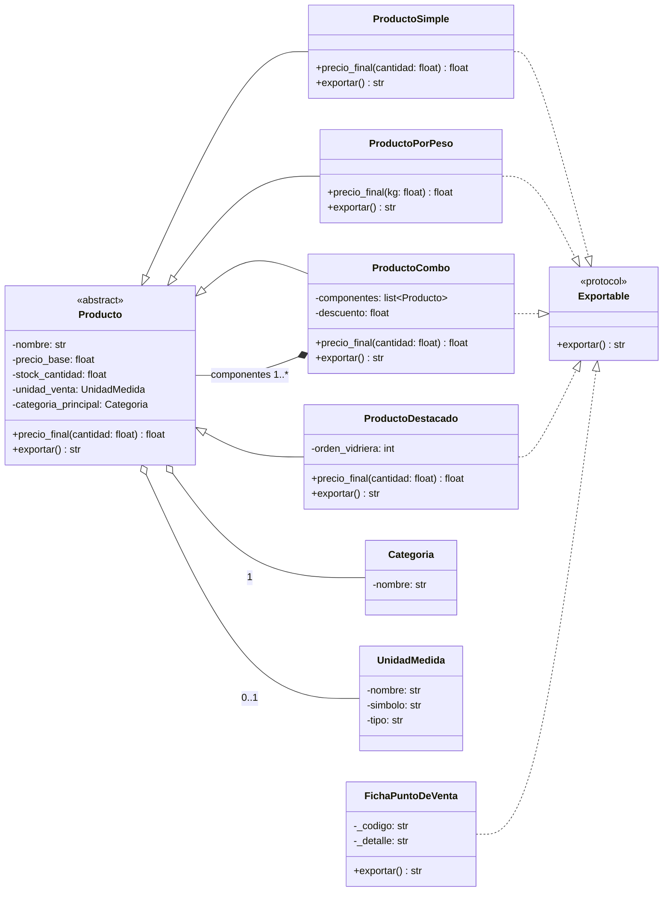
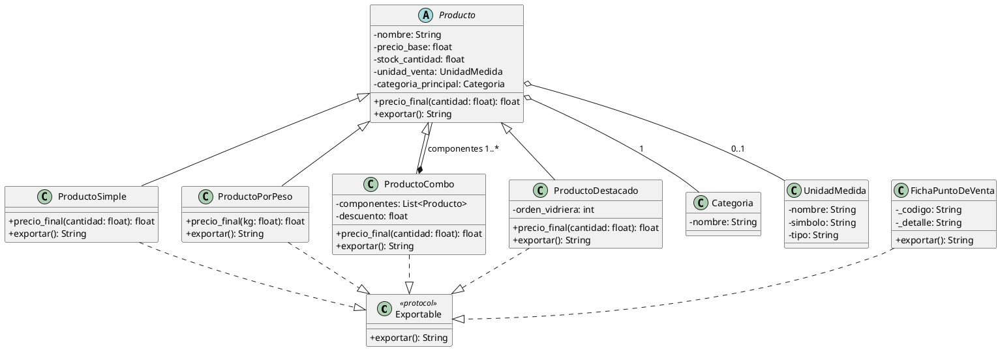

# 📦 FoodStore — Modelo de Productos  
README técnico con todas las decisiones tomadas hasta ahora

Este documento resume todas las decisiones de diseño, validaciones de dominio, justificaciones UML y reglas del PDF aplicadas al código actual del modelo de productos.

---

# 🧩 DomainError

```python
class DomainError(ValueError):
    pass
```

Motivo:
- El PDF exige “excepción de dominio” para reglas inválidas.
- Hereda de ValueError porque representa datos incorrectos del usuario o del negocio.
- Se usa en todas las validaciones específicas de cada tipo de producto.

---

# 🧩 UnidadMedida (Value Object)

```python
@dataclass(frozen=True)
class UnidadMedida:
    nombre: str
    simbolo: str
    tipo: str
```

Motivo:
- Es un Value Object: inmutable (frozen=True).
- Representa la unidad de venta (kg, g, L, unidad, etc.).
- No tiene lógica, solo datos.

---

# 🧩 Categoria (Entidad simple)

```python
class Categoria:
    def __init__(self, nombre: str, descripcion: str = "") -> None:
        if not nombre.strip():
            raise DomainError("El nombre de la categoría no puede estar vacío")
        self._nombre = nombre.strip()
        self._descripcion = descripcion
```

Motivo:
- El nombre no puede ser vacío → regla del dominio.
- Atributos privados + properties → inmutabilidad lógica.
- No tiene setters: una categoría no cambia una vez creada.

---

# 🧩 ProductoCategoria (Composición)

```python
class ProductoCategoria:
    def __init__(self, producto: Producto, categoria: Categoria, es_principal: bool = False):
        self._producto = producto
        self._categoria = categoria
        self._es_principal = es_principal
```

Motivo:
- Representa la composición Producto → ProductoCategoria.
- Cada producto crea su clasificación principal automáticamente.
- es_principal indica la categoría principal del producto.

---

# 🧩 Producto (Clase abstracta — contrato del dominio)

```python
class Producto(ABC):
    @abstractmethod
    def precio_final(self, cantidad: float) -> float:
        raise NotImplementedError
```

Motivo:
- Es abstracta: no se instancia nunca.
- Define el contrato del dominio: todas las subclases deben implementar precio_final.
- Contiene el estado común de cualquier producto:
  - nombre
  - precio_base
  - stock
  - unidad_venta
  - habilitado
  - categorías (composición)

Por qué las subclases llaman a super():
- Producto inicializa todo el estado común.
- Producto crea la clasificación principal.
- Las subclases no redefinen el dominio, solo agregan reglas específicas.

---

# 🧩 ProductoSimple (se vende por unidad)

```python
class ProductoSimple(Producto):
    def __init__(...):
        if precio_base < 1 or precio_base != int(precio_base):
            raise DomainError("precio_base debe ser entero y no puede ser negativo en ProductoSimple")
        super().__init__(...)

    def precio_final(self, cantidad: float) -> float:
        return self._precio_base * cantidad
```

Reglas del PDF:
- Se vende por pieza/unidad.
- precio_base debe ser entero y >= 1.
  - 3 → válido
  - 3.0 → válido
  - 2.5 → inválido
- Si no cumple → DomainError.
- El cálculo es: precio_final = precio_base × cantidad
- No redondea (solo ProductoPorPeso lo hace).

---

# 🧩 ProductoPorPeso (se vende por peso/volumen)

```python
class ProductoPorPeso(Producto):
    def __init__(...):
        if precio_base <= 0:
            raise DomainError("precio_base debe ser > 0 para ProductoPorPeso")
        super().__init__(...)

    def precio_final(self, cantidad: float) -> float:
        return round(self._precio_base * cantidad, 2)
```

Reglas del PDF:
- Se vende por peso o volumen (kg, g, L, ml).
- precio_base debe ser > 0.
- Admite decimales (ej: 8500.50 por kg).
- El cálculo es: precio_final = precio_base × cantidad
- Solo esta subclase redondea → round(..., 2).

---


# 🧺 6. ProductoCombo — **Decisión de diseño clave del parcial**

El PDF exige decidir:

> *“Si el precio_base y el stock del combo se reciben como datos o se derivan de sus componentes.”*

La implementación final **deriva ambos valores dinámicamente**, porque es la opción más coherente con el dominio:

### ✔ Precio base derivado
El combo no tiene precio propio.  
Su precio base es la **suma de los precios base de sus componentes**.

### ✔ Disponibilidad derivada
Un combo está disponible **solo si todos sus componentes lo están**.

### ✔ Justificación
- Si un componente cambia de precio → el combo se actualiza automáticamente.  
- Si un componente se queda sin stock → el combo deja de estar disponible.  
- Evita inconsistencias como combos con stock “999” cuando un componente está agotado.  
- Responde exactamente la pregunta conceptual del parcial.

### ✔ Constructor corregido
El combo ya **no recibe** precio_base ni stock_cantidad.  
Se sobrescriben las properties para derivarlos.
---

# 🟨 Rediseño de `ProductoDestacado` — Justificación completa

## 🟦 Reemplazo de la herencia
El diseño original asumía que *ProductoDestacado es‑un Producto*, pero destacar un producto **no modifica** su precio_final, stock, unidad_venta, categorías ni comportamiento.  
Solo agrega **información de presentación** (orden en la vidriera).  
Por lo tanto, **no corresponde usar herencia**.

La herencia se reemplaza por **composición**:  
`ProductoDestacado` ahora **envuelve** a un `Producto` existente.

### Implementación

```python
class ProductoDestacado:
    def __init__(self, producto: Producto, orden_vidriera: int) -> None:
        self._producto = producto
        self._orden_vidriera = orden_vidriera

    @property
    def orden_vidriera(self) -> int:
        return self._orden_vidriera

    @property
    def producto(self) -> Producto:
        return self._producto

    def exportar(self) -> str:
        return f"DEST|{self._producto.nombre}|{self._orden_vidriera}"
```


## 🟩 Dónde vive `orden_vidriera`
`orden_vidriera` **no pertenece al producto**, sino a la **forma en que se muestra** en la vidriera.  
Por eso vive en el **envoltorio** `ProductoDestacado` y no en el producto original.

Esto respeta el principio de responsabilidad única:  
el producto mantiene su lógica de negocio, y el destacado maneja la presentación.


## 🟪 Qué productos pueden destacarse
Con la versión anterior (herencia), solo podían destacarse los productos que heredaban de `ProductoDestacado`.

Con la nueva versión (composición), pueden destacarse **todos los productos del catálogo**, porque el envoltorio recibe:

producto: Producto

Esto permite destacar:

- ProductoSimple  
- ProductoPorPeso  
- ProductoCombo  
- Cualquier otro tipo futuro  

Sin duplicar ni recrear productos.


## 🟫 Compatibilidad con el Protocol
`ProductoDestacado` sigue cumpliendo el Protocol `exportar()`:

DEST|{nombre_del_producto}|{orden_vidriera}

No necesita heredar de `Producto` ni de `Exportable`.  
Cumple por **conformidad estructural**, tal como exige el Requerimiento 4.


## 🟧 Resumen para defensa oral
Rediseñé `ProductoDestacado` porque no cumple el criterio es‑un Producto.  
No modifica precio_final, stock, unidad_venta ni categorías.  
Solo agrega un atributo de presentación llamado `orden_vidriera`.  
Por eso reemplazo la herencia por composición: `ProductoDestacado` envuelve a un `Producto` existente.  
Así cualquier producto del catálogo puede destacarse sin duplicarlo, y `orden_vidriera` vive en el envoltorio, no en el producto.  
El diseño queda más limpio, más flexible y más alineado con el dominio.

---


# 📦 Requerimiento 4 — Exportación con Protocol  
### Integración con librería externa y polimorfismo estructural

Este módulo implementa un mecanismo de exportación común para **productos del catálogo** y **fichas externas del punto de venta**, cumpliendo el requerimiento de usar **Protocol** en lugar de herencia clásica.

---

## 🧩 1. Contrato Exportable (Protocol)

Se define un contrato llamado **Exportable**, que exige únicamente el método:

`exportar(self) -> str`

Este contrato **no se hereda**.  
Las clases lo cumplen **por tener el método**, siguiendo el principio de **conformidad estructural** (duck typing).

Esto permite integrar objetos de terceros sin modificar su código.


## 🔌 2. Integración con la librería externa

La librería externa provee la clase:

`FichaPuntoDeVenta`

Esta clase ya implementa `exportar()`, por lo que **automáticamente cumple el contrato Exportable**, sin heredar nada y sin requerir adaptadores.

Esto demuestra que el diseño es flexible y desacoplado.


## 🔄 3. Implementación de exportar() en los productos

Cada clase concreta del catálogo implementa su propia versión de `exportar()`:

- ProductoSimple  
- ProductoPorPeso  
- ProductoCombo  
- ProductoDestacado  

El formato de la cadena es **de diseño libre**, ya que el parcial evalúa únicamente:

- que devuelva `str`  
- que cumpla el contrato  
- que funcione junto con la clase externa  


## 📤 4. Función exportar_catalogo(items)

Se implementa:

`exportar_catalogo(items: list[Exportable]) -> list[str]`

Esta función recibe **productos y fichas externas mezclados** en la misma lista y exporta todos los elementos mediante polimorfismo estructural:

- sin `isinstance()`  
- sin `if/elif`  
- sin herencia forzada  
- sin modificar la librería externa  

Solo llama:

`item.exportar()`


## 🧪 5. Pruebas realizadas

Se verificó:

- Exportación individual de cada tipo de producto  
- Exportación de la clase externa FichaPuntoDeVenta  
- Exportación de listas mixtas (productos + fichas)  
- Exportación de combos anidados  
- Polimorfismo estructural funcionando en runtime  

Todas las pruebas pasaron correctamente.


## 🎯 Cierre (versión corta)

El sistema de exportación quedó simple y flexible: definí un Protocol y cualquier objeto que tenga `exportar()` entra sin pedir permiso. Los productos y la ficha externa trabajan juntos sin herencia, sin instanceof y sin tocar código de terceros. Con eso, el requerimiento queda completamente cumplido y el diseño queda limpio, desacoplado y fácil de extender.


---


# 🧩 Decisiones globales del modelo

✔ Producto es abstracto  
No se instancian productos genéricos.  
Solo se instancian productos concretos:
- ProductoSimple
- ProductoPorPeso
- (más adelante) ProductoCombo
- (a analizar) ProductoDestacado

✔ Las validaciones van en el constructor de cada subclase  
Porque son reglas del tipo de producto, no del cálculo.

✔ precio_final siempre recibe cantidad  
El UML exige que todas las subclases respeten ese nombre de parámetro.

✔ precio_publicado formatea con :.2f  
Por eso las otras subclases no necesitan redondear.

---

# UML




---

# ✅ **2. UML en PlantUML (para exportar PNG)**

```markdown

```