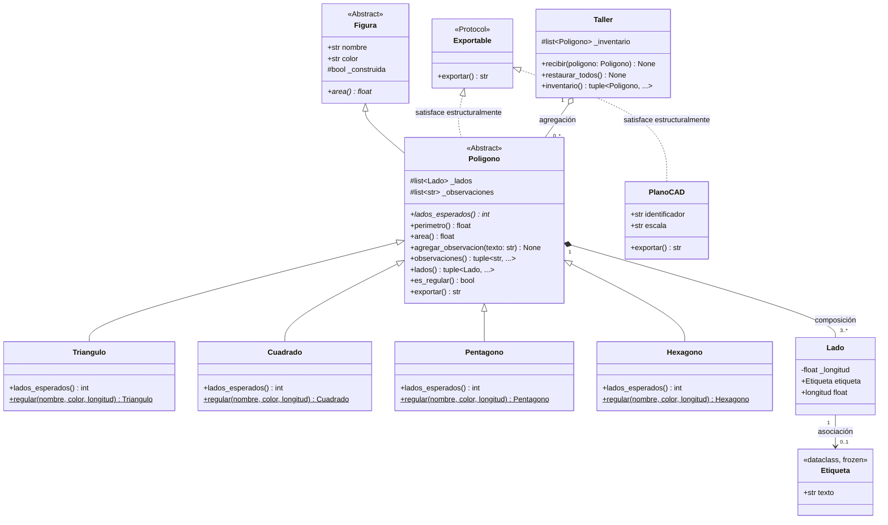

# PROGRAMACIÓN IV

## Trabajo Práctico Integrador - Unidad 3
### Programación Orientada a Objetos: de Java a Python

### Autor: Matias Manuel Carro
**matiasmanuelcarro@gmail.com**
**Legajo: 18743**

---

Breve guía del repositorio: qué hace cada archivo y cómo ejecutar las demos principales.


## Qué hace cada archivo

- **figuras.py** - Implementa el dominio: `Figura` (ABC), `Poligono`, `Lado`, `Etiqueta`, subclases concretas (`Triangulo`, `Cuadrado`, `Pentagono`, `Hexagono`) y `Taller`. Incluye validaciones, copia defensiva y `exportar()` para cumplir el contrato estructural. No ejecutar demos desde este módulo.

- **main.py** - Demo integrador final. Crea figuras, demuestra composición y agregación, restaura inventario en el taller, exporta objetos (incluyendo `PlanoCAD`) y muestra comprobaciones de diseño y fallas tempranas. Ejecutar para la demo completa.

- **parte1_diagnostico.py** - Desarrollo de la Parte 1: codigo corregido sin javaismos.

- **demo_sintomas.py** - Scripts reproducibles que muestran síntomas clásicos (argumento por defecto mutable, falta de copia defensiva). Útil para ver los problemas originales y su efecto.

- **demo_property.py** - Comparación antes y después del uso de `@property` en `Lado.longitud`, con ejemplos de validación y protección del estado.

- **libreria_externa.py** - Simula la dependencia externa `PlanoCAD` (SDK de terceros) usada en la demo de exportación. Incluida para que `exportar_todo` acepte objetos externos sin herencia.

- **uml/modelo_final.md** - Diagrama Mermaid o PlantUML del modelo final que refleja las decisiones de diseño: herencia, composición, agregación y protocolos. Listo para convertir a PNG.

- **informe.md** - Informe resumido (objetivo: 1 carilla) con la justificación conceptual, la tabla de java‑ismos y las decisiones de diseño.

---

## Que ejecutar


**Demo integrador completo**
python main.py

**Reproducir síntomas originales**
python demo_sintomas.py

**Ver @property en acción**
python demo_property.py

---

# Parte 1 

## 1. Tabla de Diagnóstico de Java-ismos

| # | Java‑ismo | Ubicación (clase.método) | Principio que lo explica | Síntoma observable |
|---|---|---|---|---|
| 1 | Getters preventivos sin lógica (`getNombre`, `getColor`) | `Figura.getNombre`, `Figura.getColor` | **Compilador – Acuerdo** (Encapsulamiento por convención) | En Java se implementan para anticipar posibles cambios futuros en los atributos. En Python los atributos se exponen de manera directa (`figura.nombre`), y si en algún momento se requiere validación, se incorpora `@property` sin afectar el código existente. |
| 2 | Getter y Setter tradicionales estilo Java Bean | `Lado.getLongitud`, `Lado.setLongitud` | **Compilador – Acuerdo** (`@property` para lógica concreta) | Obliga a utilizar métodos extensos como `lado.getLongitud()` o `lado.setLongitud(5)`. En Python se emplea `@property` para mantener un acceso simple (`lado.longitud = 5`) mientras se valida internamente que el valor no sea negativo. |
| 3 | Variable mutable de clase utilizada como `static` compartido | `Poligono.catalogo = []` | **Declaración – Runtime** (Objetos de clase compartidos) | La lista pertenece a la clase y no a cada instancia. Si cualquier parte del programa la modifica, afecta simultáneamente a todos los polígonos, generando un estado global no controlado. |
| 4 | Argumentos por defecto mutables (`lados=[]`, `observaciones=[]`) | `Poligono.__init__` | **Declaración – Runtime** (Valores por defecto evaluados al inicio) | La lista vacía se crea una única vez al cargar el archivo. Si se instancian dos polígonos sin proporcionar observaciones, ambos comparten la misma lista en memoria (`p1._observaciones is p2._observaciones` resulta `True`). |
| 5 | Omitir `super().__init__()` y asignar atributos manualmente | `Poligono.__init__` | **Compilador – Acuerdo** (Cadena de herencia) | El constructor de la clase base (`Figura`) no se ejecuta. Como consecuencia, el atributo de control `_construida = True` nunca se inicializa, dejando la instancia incompleta. |
| 6 | Guardar y devolver la lista interna sin copia defensiva | `Poligono.__init__` y `Poligono.getLados` | **Compilador – Acuerdo** (Protección del estado interno) | Código externo puede modificar la lista interna mediante operaciones como `.clear()`, alterando la estructura del polígono sin que este pueda evitarlo. |
| 7 | Uso de un bucle `for` con acumulador manual en lugar de herramientas nativas | `Poligono.perimetro` | **Compilador – Acuerdo** (Aprovechamiento del lenguaje) | Se implementan varias líneas de código imperativo para una operación que en Python puede expresarse de manera más clara y eficiente mediante `sum(...)`. |
| 8 | Simulación de sobrecarga de constructores con `*args` e `isinstance` | `Triangulo.__init__` y `Cuadrado.__init__` | **Herencia – Duck typing** (Constructores alternativos) | En Java es posible definir múltiples constructores con distintas firmas. En Python no existe esa capacidad, y recrearla mediante verificaciones de tipo produce código complejo y frágil. La solución idiomática consiste en utilizar parámetros con nombre o métodos de clase (`@classmethod`). |


---

## 2. Corrección y Justificación de los 8 Java-ismos


### 1. Eliminar getters sin contenido (`getNombre`, `getColor`)
* **Ubicación original:** `Figura.getNombre()` y `Figura.getColor()`.
* **Corrección aplicada:** Se removieron ambos métodos y se accede directamente a los atributos mediante `figura.nombre` y `figura.color`.
* **Motivo de la corrección:** En Java es habitual crear métodos de acceso preventivos, ya que si en el futuro se necesita validar un atributo, reemplazar el acceso directo por un método puede afectar código existente. En Python existe un acuerdo general, los atributos se exponen de manera directa. Si posteriormente se requiere incorporar validación, se utiliza `@property`, lo cual permite mantener el mismo acceso (`figura.nombre`) sin generar incompatibilidades en el código cliente.


### 2. Sustituir el patrón getter/setter tradicional por `@property`
* **Ubicación original:** `Lado.getLongitud()` y `Lado.setLongitud(valor)`.
* **Corrección aplicada:** Se reemplazaron por `@property def longitud(self)` y `@longitud.setter`, incorporando validación para asegurar que la longitud sea mayor que cero.
* **Motivo de la corrección:** En Java se emplean métodos explícitos para proteger los datos internos. En Python, la utilización de `@property` se reserva para situaciones donde existe una regla de negocio que debe controlarse (por ejemplo, impedir valores negativos). Esto permite mantener una interfaz clara y sencilla (`lado.longitud = 5`) sin perder control sobre la validación interna.


### 3. Eliminar la lista compartida definida en la clase (`catalogo = []`)
* **Ubicación original:** `Poligono.catalogo = []`.
* **Corrección aplicada:** Se retiró la lista de la definición de la clase y se eliminó el autorregistro automático dentro del constructor.
* **Motivo de la corrección:** En Java, un atributo `static` posee un comportamiento controlado por el compilador. En Python, cualquier elemento definido de manera independiente dentro de una clase se crea al cargar el módulo y es compartido por todas las instancias. Esto implica que cualquier modificación realizada por un objeto afecta al catálogo de todos los demás, generando efectos no deseados y difíciles de detectar.


### 4. Reemplazar argumentos por defecto mutables (`lados=[]`)
* **Ubicación original:** `Poligono.__init__(..., lados=[], observaciones=[])`.
* **Corrección aplicada:** Se reemplazaron los valores por defecto por `None`, y dentro del constructor se genera una lista nueva cuando corresponde (`list(lados) if lados is not None else []`).
* **Motivo de la corrección:** En Python los valores por defecto se inicializan una única vez al leer el archivo, no en cada invocación de la función. Si se utiliza `[]`, todas las instancias que no proporcionen ese argumento compartirán la misma lista en memoria. Emplear `None` evita este comportamiento, ya que `None` no es modificable y permite crear una lista independiente para cada objeto.


### 5. Invocar `super().__init__()` en lugar de replicar asignaciones manuales
* **Ubicación original:** `Poligono.__init__`.
* **Corrección aplicada:** Se incorporó la llamada `super().__init__(nombre, color)` al inicio del constructor.
* **Motivo de la corrección:** En Java la llamada al constructor de la clase base es obligatoria o asistida por el compilador. En Python es responsabilidad del desarrollador realizarla explícitamente. Al omitirla, el constructor de `Figura` no se ejecutaba y el atributo de control `_construida = True` nunca se establecía, dejando la instancia incompleta.


### 6. Utilizar copia defensiva para la lista de lados
* **Ubicación original:** En `Poligono.__init__` (`self._lados = lados`) y en `Poligono.getLados()` (`return self._lados`).
* **Corrección aplicada:** El constructor clona la lista recibida (`list(lados)`), y el método de consulta devuelve una tupla inmutable (`tuple(self._lados)`).
* **Motivo de la corrección:** Dado que Python no implementa privacidad estricta mediante el compilador, entregar la lista original permite que código externo la modifique (por ejemplo, mediante `.clear()`), afectando la estructura interna del objeto. Proveer una copia o una tupla evita alteraciones externas no deseadas.


### 7. Sustituir el bucle acumulador manual por `sum()`
* **Ubicación original:** `Poligono.perimetro()`.
* **Corrección aplicada:** Se reemplazó el bucle con acumulación manual por la expresión `sum(l.longitud for l in self._lados)`.
* **Motivo de la corrección:** En lenguajes como Java es común implementar acumuladores explícitos. En Python se fomenta el uso de herramientas nativas que expresan la intención de manera más clara y eficiente. La función `sum()` combinada con un generador permite expresar la misma lógica en una forma más concisa y legible.


### 8. Eliminar la sobrecarga simulada mediante `*args` e `isinstance`
* **Ubicación original:** `Triangulo.__init__(*args)` y `Cuadrado.__init__(*args)`.
* **Corrección aplicada:** Se definió un constructor convencional con argumentos opcionales y se añadió un método de clase (`@classmethod def desde_lados`) para la construcción alternativa.
* **Motivo de la corrección:** En Java es posible definir múltiples constructores con diferentes firmas, y el compilador selecciona el adecuado. En Python no existe esa capacidad de sobrecarga. Intentar emularla mediante inspección de tipos o cantidad de argumentos genera código difícil de mantener y propenso a errores. La solución idiomática en Python consiste en emplear parámetros con nombres claros o constructores alternativos que expresen la intención de manera explícita.


### demo_sintomas.py 

```python
class PoligonoOriginal:
    # Simula el constructor original con defaults mutables y asignación directa sin copia
    #El linter informa: Do not use mutable data structures for argument 
    def __init__(self, lados=[], observaciones=[]):
        self._lados = lados  # Aliasing: guarda la referencia directa
        self._observaciones = observaciones  # Default mutable


def demostrar_sintoma_1_default_mutable():
    print("--- SÍNTOMA 1: Argumento por defecto mutable (observaciones=[]) ---")

    # Creamos dos instancias usando el valor por defecto
    p1 = PoligonoOriginal()
    p2 = PoligonoOriginal()

    # Agregamos una observación únicamente al primer polígono
    p1._observaciones.append("Revisar vértice A")

    # Verificación de identidad en memoria
    mismo_objeto = p1._observaciones is p2._observaciones

    print(f"¿p1._observaciones es el mismo objeto que p2._observaciones?: {mismo_objeto}")
    print(f"Observaciones de p1: {p1._observaciones}")
    print(f"Observaciones de p2 (sin haberle agregado nada): {p2._observaciones}")

    print(
        "Fallo observable: p2 quedó contaminado con los datos de p1 "
        "porque ambos comparten la misma lista creada en tiempo de definición."
    )

    def demostrar_sintoma_2_aliasing_sin_copia_defensiva():
    print("\n--- SÍNTOMA 2: Violación de encapsulamiento por falta de copia defensiva ---")

    lista_externa = ["LadoA", "LadoB", "LadoC"]

    # Instanciamos el polígono pasándole la lista externa
    p = PoligonoOriginal(lados=lista_externa)

    print(f"Lados internos de p al iniciar: {p._lados}")

    # Un actor externo modifica su propia lista después de haber creado el objeto
    lista_externa.clear()

    print(f"Lados internos de p tras vaciar la lista externa: {p._lados}")

    print(
        "Fallo observable: el estado interno de p fue corrompido desde afuera sin pasar "
        "por ningún método del polígono, porque se guardó el alias en vez de una copia."
    )


if __name__ == "__main__":
    demostrar_sintoma_1_default_mutable()
    demostrar_sintoma_2_aliasing_sin_copia_defensiva()

```

Salida en consola:

```
--- SÍNTOMA 1: Argumento por defecto mutable (observaciones=[]) ---
¿p1._observaciones es el mismo objeto que p2._observaciones?: True
Observaciones de p1: ['Revisar vértice A']
Observaciones de p2 (sin haberle agregado nada): ['Revisar vértice A']
Fallo observable: p2 quedó contaminado con los datos de p1 porque ambos comparten la misma lista creada en tiempo de definición.

--- SÍNTOMA 2: Violación de encapsulamiento por falta de copia defensiva ---
Lados internos de p al iniciar: ['LadoA', 'LadoB', 'LadoC']
Lados internos de p tras vaciar la lista externa: []
Fallo observable: el estado interno de p fue corrompido desde afuera sin pasar por ningún método del polígono, porque se guardó el alias en vez de una copia.

```

***Explicación Conceptual: ¿Por qué pasa y cómo funciona?***

#### 1. Síntoma de Argumento por Defecto Mutable

* **Por qué ocurre:**
  En Java, los valores por defecto no existen en la firma; se resuelven mediante sobrecarga en tiempo de compilación. En Python, las expresiones en los argumentos por defecto se evalúan **una única vez cuando el módulo se lee e interpreta** (tiempo de carga/definición), y no cada vez que se instancia la clase.
* **Cómo funciona el fallo en memoria:**
  Al escribir `def __init__(self, observaciones=[])`, Python reserva un único objeto de tipo lista en la memoria RAM vinculado a la firma del método. Cada vez que se ejecuta `PoligonoOriginal()` sin parámetros, el puntero `self._observaciones` de la nueva instancia apunta a esa misma dirección de memoria. Cuando `p1` agrega un elemento a su lista, está mutando la estructura compartida, por lo que `p2` ve la modificación de forma inmediata y automática (`p1._observaciones is p2._observaciones` evalúa a `True`).
* **Cómo se soluciona:**
  Se usa `None` como valor por defecto en la firma (`observaciones: list[str] | None = None`).  
  Luego, dentro del constructor, se verifica: si el parámetro llegó como `None`, se crea una lista nueva (`[]`) exclusivamente para esa instancia.

  La idea es evitar que varias instancias compartan la misma lista por accidente.


#### 2. Síntoma de Aliasing por Falta de Copia Defensiva

* **Por qué ocurre :**
  En Python no existen modificadores de acceso por compilador como `private`. Toda asignación de variables sobre objetos mutables (como listas o diccionarios) copia únicamente la referencia en memoria, no el contenido del contenedor.
* **Cómo funciona el fallo en memoria:**
  Al hacer `self._lados = lados`, el atributo interno `_lados` y la variable externa `lista_externa` quedan vinculados al mismo bloque de memoria. El objeto polígono pierde el control exclusivo sobre sus propios componentes. Si el código cliente que creó la lista decide vaciarla con `lista_externa.clear()`, el polígono se queda sin lados sin haber ejecutado ningún método propio, rompiendo la invariante estructural de la figura.
* **Cómo se soluciona:**
  Aplicando **copia defensiva en la entrada y en la salida**:
  * En la entrada (constructor), se clona la colección entrante creando una lista nueva: `self._lados = list(lados) if lados is not None else []`.
  * En la salida (método o propiedad de lectura), se expone una tupla inmutable: `tuple(self._lados)`. De este modo, cualquier operación de mutación externa sobre la tupla es rechazada directamente por el lenguaje.
  
--- 

  ## 4. Demostración y Justificación de @property (`demo_property.py`)

En el diseño original existían métodos de acceso y mutación tradicionales estilo Java Bean (`getLongitud` y `setLongitud`) dentro de la clase `Lado`. De todos los getters y setters del diagnóstico, este es el único caso donde correspondía aplicar `@property` porque existe una regla de negocio real: **la longitud de un lado debe ser un número estrictamente positivo**.

El archivo `demo_property.py` muestra, de manera comparativa, el enfoque tradicional frente a la solución en Python. Allí se muestra cómo `@property` permite mantener un acceso a los atributos, sin perder las ventajas del encapsulamiento cuando es necesario aplicar validaciones internas.


### Explicación del problema con el enfoque Java Bean 

**Problema del enfoque Java Bean:**  
El uso de getters y setters tradicionales vuelve el código más verboso y no aporta verdadera protección en Python. Los atributos pueden modificarse directamente, incluso de manera incorrecta, sin que el sistema lo impida.


### Por qué `@property` es la solución correcta 

**Ventajas de `@property`:**  
`@property` permite una interfaz clara (`lado.longitud`) y asegura que toda asignación pase por la validación correspondiente. Además, garantiza que el objeto nazca con valores correctos desde el constructor.

---

### Codigo y demostracion en la salida de la consola:

```python

"""demo_property.py — Demostración de transición a @property.

Prueba que el código cliente no cambia su sintaxis al incorporar validación
mediante @property, a diferencia de los getters/setters estilo Java.
"""

# =====================================================================
# ENFOQUE ANTES: Estilo Java Bean 
# =====================================================================


class LadoJavaismo:

    def __init__(self, longitud: float):
        self._longitud = longitud

    def getLongitud(self) -> float:
        return self._longitud

    def setLongitud(self, valor: float) -> None:
        if valor <= 0:
            raise ValueError("La longitud debe ser estrictamente positiva.")
        self._longitud = valor


# =====================================================================
# ENFOQUE DESPUÉS: Utilizando @property 
# =====================================================================


class LadoPythonico:

    def __init__(self, longitud: float):
        # Al asignar self.longitud pasa por el setter y valida desde el nacimiento
        self.longitud = longitud

    @property
    def longitud(self) -> float:
        return self._longitud

    @longitud.setter
    def longitud(self, valor: float) -> None:
        if valor <= 0:
            raise ValueError("La longitud debe ser estrictamente positiva.")
        self._longitud = valor


# =====================================================================
# DEMOSTRACIÓN: Comparación del impacto en el Código Cliente
# =====================================================================


def probar_enfoque_java():
    print("--- Enfoque Antes (Estilo Java) ---\n")
    lado_java = LadoJavaismo(10.0)

    # El cliente está obligado a invocar métodos con paréntesis
    print(f"Lectura con getLongitud(): {lado_java.getLongitud()}")
    lado_java.setLongitud(25.5)
    print(f"Lectura tras setLongitud(25.5): {lado_java.getLongitud()}")

    # Además, el atributo interno queda expuesto si se accede por error
    lado_java._longitud = -999.0
    print(
        f"Demostracion: Se ignoro el setter asignando al atributo privado: {lado_java._longitud}\n"
    )


def probar_enfoque_python():
    print("\n--- Enfoque Python (@property) ---\n")

    # Supongamos que el cliente consumía atributos públicos normales:
    # lado = Lado(10.0)
    # total = lado.longitud + 5.0
    # lado.longitud = 25.5

    # Al migrar a @property, las líneas del cliente son exactamente las mismas:
    lado = LadoPythonico(10.0)

    # Lectura directa (sintaxis de atributo sin paréntesis)
    print(f"Lectura directa (lado.longitud): {lado.longitud}")

    # Asignación directa (sintaxis de atributo)
    lado.longitud = 25.5
    print(f"Lectura tras reasignación (lado.longitud = 25.5): {lado.longitud}")

    # Operaciones matemáticas limpias
    perimetro_estimado = lado.longitud * 4
    print(f"Cálculo directo (lado.longitud * 4): {perimetro_estimado}")

    # 4. Verificación de la invariante: frena valores inválidos transparentemente
    print("Intentando asignar valor negativo (lado.longitud = -10.0)...")
    try:
        lado.longitud = -10.0
    except ValueError as error:
        print(f"Excepción capturada con éxito: {error}")

    print(
        f"El valor se mantuvo protegido en su último estado válido: {lado.longitud}"
    )


if __name__ == "__main__":
    probar_enfoque_java()
    probar_enfoque_python()

```


Salida en consola:

```
--- Enfoque Antes (Estilo Java) ---

Lectura con getLongitud(): 10.0
Lectura tras setLongitud(25.5): 25.5
Demostracion: Se ignoro el setter asignando al atributo privado: -999.0


--- Enfoque Python (@property) ---

Lectura directa (lado.longitud): 10.0
Lectura tras reasignación (lado.longitud = 25.5): 25.5
Cálculo directo (lado.longitud * 4): 102.0
Intentando asignar valor negativo (lado.longitud = -10.0)...
Excepción capturada con éxito: La longitud debe ser estrictamente positiva.
El valor se mantuvo protegido en su último estado válido: 25.5
```
---

# Parte 2 - Relaciones estructurales 

## Relaciones Estructurales y Diferenciación en el Código

En Python, la sintaxis para almacenar un atributo siempre es la misma (`self._algo = algo`). Por esto, la distinción entre **Asociación**, **Agregación** y **Composición** no está en la asignación, sino en:

1. **La dependencia de existencia y ciclo de vida** entre las partes.
2. **Quién es responsable de instanciar el objeto.**
3. **El grado de acoplamiento e independencia que expone la firma de la interfaz.**

Analisis de cada relación señalando la **línea exacta que la delata**:


### 1. Lado - Etiqueta: Asociación (0..1)

* **Relación:** Relación débil y opcional entre dos entidades independientes. Un `Lado` puede existir con o sin una `Etiqueta`, y la etiqueta no determina la existencia del lado.
* **Líneas exactas que lo delatan:**  
  En la cabecera del constructor:
  ```python
  def __init__(self, longitud: float, etiqueta: Etiqueta | None = None) -> None:
  ```
  y en su asignación:
  ```python
  self.etiqueta: Etiqueta | None = etiqueta
  ```
* **Por qué lo delata:** El uso del type hint de unión `Etiqueta | None` junto con el valor por defecto `= None`. Revela explícitamente la multiplicidad `0..1`: el objeto colaborador es prescindible para la construcción y vida de la instancia receptora.


### 2. Taller - Poligono: Agregación (0..*)

* **Relación:** Relación todo/parte débil. El `Taller` contiene polígonos que no fueron fabricados por él, sino que le fueron provistos ya creados desde un ámbito externo. Si el `Taller` es destruido o eliminado de memoria, los polígonos continúan existiendo de manera autónoma.
* **Líneas exactas que lo delatan:**  
  En la firma y asignación del constructor:
  ```python
  self._inventario: list[Poligono] = list(poligonos) if poligonos is not None else []
  ```
  y en el método de incorporación:
  ```python
  def recibir(self, poligono: Poligono) -> None:
      self._inventario.append(poligono)
  ```
* **Por qué lo delata:** En ningún punto dentro de `Taller` se ejecuta `Poligono(...)`. La clase se limita a recibir instancias vivas inyectadas por parámetro y agruparlas en su colección interna. El ciclo de vida de los polígonos es completamente ajeno al del taller.


### 3. Poligono - Lado: Composición (3..*)

* **Relación:** Relación todo/parte fuerte y existencia condicionada por contrato. Un `Poligono` no puede definirse geométricamente sin sus lados; estos constituyen su estructura física esencial.
* **Líneas exactas que lo delatan:**  
  En el constructor con la copia defensiva obligatoria:
  ```python
  self._lados = list(lados) if lados is not None else []
  ```
  combinado con el método abstracto:
  ```python
  @abstractmethod
  def lados_esperados(self) -> int:
  ```
  y la exposición blindada en la salida:
  ```python
  def lados(self) -> tuple[Lado, ...]:
      return tuple(self._lados)
  ```
* **Por qué lo delata:**  
  Aunque los lados puedan venir desde afuera, el `Poligono` deja claro que la estructura pasa a pertenecerle:

  * **Independencia de la lista:**  
    Al copiar la lista de entrada y devolver una versión inmutable, el polígono demuestra que controla su propia colección y que nada externo puede modificarla.

  * **Cantidad de lados obligatoria:**  
    Cada subclase define cuántos lados debe tener para ser válida. Esto revela que la figura solo tiene sentido dentro del polígono; si el polígono desaparece, esos lados ya no representan una estructura coherente.


## Copia Defensiva en Multiplicidades 

Para evitar modificaciones externas no deseadas, se aplica **copia defensiva** al devolver las colecciones:

### 1. En la salida (consulta de colecciones)

Ni `Poligono` ni `Taller` entregan directamente sus listas internas. En lugar de eso, devuelven una **tupla inmutable**, lo que asegura que el código externo no pueda alterar el contenido mediante operaciones como `.clear()`, `.pop()` o `.append()`.

* **`Poligono.lados()` (Composición `3..*`):**
  ```python
  def lados(self) -> tuple[Lado, ...]:
      # Retorna una tupla inmutable en lugar de la lista interna
      return tuple(self._lados)
  ```

* **`Taller.inventario()` (Agregación `0..*`):**
  ```python
  def inventario(self) -> tuple[Poligono, ...]:
      # Retorna una tupla inmutable que blinda el inventario
      return tuple(self._inventario)
  ```

### 2. En la entrada (Construcción e Ingesta)

Al recibir listas desde el cliente, los constructores crean una copia nueva usando `list(...)`. Esto asegura que mutaciones posteriores sobre la lista externa no modifiquen la original:

* **En `Poligono.__init__`:**
  ```python
  self._lados = list(lados) if lados is not None else []
  ```

* **En `Taller.__init__`:**
  ```python
  self._inventario = list(poligonos) if poligonos is not None else []
  ```


## PARTE 3: Herencia justificada por dominio y decisión sobre PoligonoRegular

### 1. Justificación de la Jerarquía de Herencia 

* `Poligono` hereda de `Figura` y se declara como clase abstracta (`ABC`). Define el contrato obligatorio `@abstractmethod def lados_esperados(self) -> int`.
* Las subclases `Triangulo` (3), `Cuadrado` (4), `Pentagono` (5) y `Hexagono` (6) cumplen genuinamente la relación **«es-un» polígono** y validan en su construcción que la lista de lados coincida estrictamente con su invariante geométrica.
* **Falla temprana :** Si se intenta instanciar `Poligono` directamente o una subclase incompleta que no implemente `lados_esperados()`, Python impide la creación arrojando un `TypeError` en tiempo de instanciación. Asimismo, si a un `Pentagono` se le intentan pasar 4 lados, el constructor arroja un `ValueError` inmediatamente.

---

### 2. Qué hacer con `PoligonoRegular`

#### Decisión: Se descarta la herencia y se rediseña el modelo.

En el código inicial, `PoligonoRegular` existía como una clase intermedia de la que debían heredar las figuras regulares. Esto es una **costumbre de diseño arrastrada de Java**, donde se crean tipos e interfaces exclusivamente para que una colección (`List<PoligonoRegular>`) restrinja tipos en tiempo de compilación.

#### Justificación:

1. **La regularidad es una condición, no un tipo nuevo:**  
   Un triángulo equilátero sigue siendo un triángulo; solo cumple una propiedad adicional (todos los lados iguales). Crear clases separadas para cada versión “regular” genera jerarquías innecesarias.

2. **Python no necesita esa clase intermedia:**  
   Con tipado dinámico y *Duck Typing*, no hace falta una clase abstracta vacía para agrupar polígonos regulares. Basta con verificar la propiedad cuando corresponda.

#### Con qué se reemplazó en el código:

1. **Consulta del estado mediante un método claro:** 
   Se agregó en la clase base `Poligono` el método `es_regular() -> bool`:
   ```python
   def es_regular(self) -> bool:
       if not self._lados:
           return False
       primera = self._lados[0].longitud
       return all(lado.longitud == primera for lado in self._lados)
   ```
   verifica si todos los lados tienen la misma longitud. De este modo, cualquier figura (triángulo, hexágono, etc.) puede indicar si es regular basándose en su propio estado interno.

2. **Constructores alternativos más expresivos:**  
   En cada subclase incorpora un  `@classmethod regular(cls, nombre, color, longitud_lado)` que permite crear fácilmente una figura con lados iguales, sin necesidad de definir nuevas clases para cada versión “regular”.

   ---

## PARTE 4: ABC vs. Protocol 

### Por qué una ABC no hubiera servido para `PlanoCAD`

Una ABC exige herencia explícita: cualquier clase que quiera cumplir su contrato debe **heredar** de ella e implementar sus métodos abstractos. Sin embargo, `PlanoCAD` proviene de una librería externa y **no puede ser modificada**. Esto implica que no puede heredar de nuestra ABC ni implementar sus métodos abstractos según las reglas del compilador.

En cambio, un `Protocol` funciona por **subtipado estructural**: alcanza con que la clase tenga el método `exportar()`, sin necesidad de heredar nada. Esto permite que `Poligono` y `PlanoCAD` cumplan el mismo contrato en runtime, aun cuando provienen de jerarquías distintas y uno de ellos es externo al dominio.


# Diagrama UML

# Modelo de Dominio - Diagrama de Clases UML

El siguiente diagrama modela la arquitectura final del sistema implementada en `figuras.py` y  `libreria_externa.py`.

```
classDiagram
    direction TB

    %% ==========================================
    %% Contratos e Interfaces
    %% ==========================================
    class Exportable {
        <<Protocol>>
        +exportar() str
    }

    class Figura {
        <<Abstract>>
        +str nombre
        +str color
        #bool _construida
        +area()* float
    }

    class Poligono {
        <<Abstract>>
        #list~Lado~ _lados
        #list~str~ _observaciones
        +lados_esperados()* int
        +perimetro() float
        +area() float
        +agregar_observacion(texto: str) None
        +observaciones() tuple~str, ...~
        +lados() tuple~Lado, ...~
        +es_regular() bool
        +exportar() str
    }

    %% ==========================================
    %% Subclases Concretas de Poligono
    %% ==========================================
    class Triangulo {
        +lados_esperados() int
        +regular(nombre, color, longitud)$ Triangulo
    }

    class Cuadrado {
        +lados_esperados() int
        +regular(nombre, color, longitud)$ Cuadrado
    }

    class Pentagono {
        +lados_esperados() int
        +regular(nombre, color, longitud)$ Pentagono
    }

    class Hexagono {
        +lados_esperados() int
        +regular(nombre, color, longitud)$ Hexagono
    }

    %% ==========================================
    %% Componentes Estructurales
    %% ==========================================
    class Etiqueta {
        <<dataclass, frozen>>
        +str texto
    }

    class Lado {
        -float _longitud
        +Etiqueta etiqueta
        +longitud float
    }

    class Taller {
        #list~Poligono~ _inventario
        +recibir(poligono: Poligono) None
        +restaurar_todos() None
        +inventario() tuple~Poligono, ...~
    }

    %% ==========================================
    %% Clase Externa (SDK Tercero)
    %% ==========================================
    class PlanoCAD {
        +str identificador
        +str escala
        +exportar() str
    }

    %% ==========================================
    %% Jerarquía de Herencia (Generalización)
    %% ==========================================
    Figura <|-- Poligono
    Poligono <|-- Triangulo
    Poligono <|-- Cuadrado
    Poligono <|-- Pentagono
    Poligono <|-- Hexagono

    %% ==========================================
    %% Cumplimiento Estructural de Protocolo (Duck Typing)
    %% ==========================================
    Exportable <|.. Poligono : satisface estructuralmente
    Exportable <|.. PlanoCAD : satisface estructuralmente

    %% ==========================================
    %% Relaciones y Multiplicidades
    %% ==========================================
    %% Composición: Poligono posee de 3 a N lados
    Poligono "1" *-- "3..*" Lado : composición

    %% Asociación: Un Lado puede tener opcionalmente 0 o 1 Etiqueta
    Lado "1" --> "0..1" Etiqueta : asociación

    %% Agregación: Un Taller contiene de 0 a N Poligonos externos
    Taller "1" o-- "0..*" Poligono : agregación
```
### Grafico UML:




