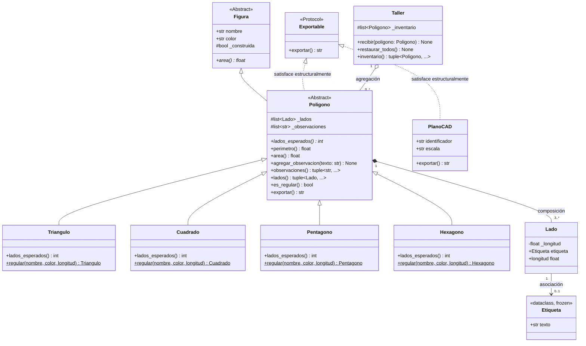

# Diagrama UML en Mermaid

```mermaid
classDiagram
    direction TB

    %% ==========================================
    %% Contratos e Interfaces
    %% ==========================================
    class Exportable {
        <<Protocol>>
        +exportar() str
    }

    class Figura {
        <<Abstract>>
        +str nombre
        +str color
        #bool _construida
        +area()* float
    }

    class Poligono {
        <<Abstract>>
        #list~Lado~ _lados
        #list~str~ _observaciones
        +lados_esperados()* int
        +perimetro() float
        +area() float
        +agregar_observacion(texto: str) None
        +observaciones() tuple~str, ...~
        +lados() tuple~Lado, ...~
        +es_regular() bool
        +exportar() str
    }

    %% ==========================================
    %% Subclases Concretas de Poligono
    %% ==========================================
    class Triangulo {
        +lados_esperados() int
        +regular(nombre, color, longitud)$ Triangulo
    }

    class Cuadrado {
        +lados_esperados() int
        +regular(nombre, color, longitud)$ Cuadrado
    }

    class Pentagono {
        +lados_esperados() int
        +regular(nombre, color, longitud)$ Pentagono
    }

    class Hexagono {
        +lados_esperados() int
        +regular(nombre, color, longitud)$ Hexagono
    }

    %% ==========================================
    %% Componentes Estructurales
    %% ==========================================
    class Etiqueta {
        <<dataclass, frozen>>
        +str texto
    }

    class Lado {
        -float _longitud
        +Etiqueta etiqueta
        +longitud float
    }

    class Taller {
        #list~Poligono~ _inventario
        +recibir(poligono: Poligono) None
        +restaurar_todos() None
        +inventario() tuple~Poligono, ...~
    }

    %% ==========================================
    %% Clase Externa (SDK Tercero)
    %% ==========================================
    class PlanoCAD {
        +str identificador
        +str escala
        +exportar() str
    }

    %% ==========================================
    %% Jerarquía de Herencia (Generalización)
    %% ==========================================
    Figura <|-- Poligono
    Poligono <|-- Triangulo
    Poligono <|-- Cuadrado
    Poligono <|-- Pentagono
    Poligono <|-- Hexagono

    %% ==========================================
    %% Cumplimiento Estructural de Protocolo (Duck Typing)
    %% ==========================================
    Exportable <|.. Poligono : satisface estructuralmente
    Exportable <|.. PlanoCAD : satisface estructuralmente

    %% ==========================================
    %% Relaciones y Multiplicidades
    %% ==========================================
    %% Composición: Poligono posee de 3 a N lados
    Poligono "1" *-- "3..*" Lado : composición

    %% Asociación: Un Lado puede tener opcionalmente 0 o 1 Etiqueta
    Lado "1" --> "0..1" Etiqueta : asociación

    %% Agregación: Un Taller contiene de 0 a N Poligonos externos
    Taller "1" o-- "0..*" Poligono : agregación
```
