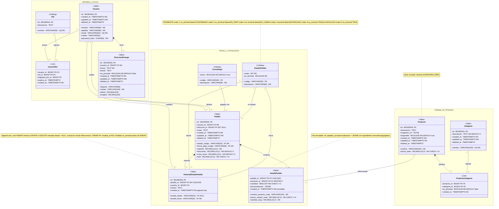

```mermaid
classDiagram
    namespace Identidad_y_Acceso {
        class Rol {
            <<Catalog>>
            +id : BIGSERIAL PK
            +nombre : VARCHAR(50) UQ NN
            +descripcion : TEXT
        }
        
        class Usuario {
            <<Table>>
            +id : BIGSERIAL PK
            +nombre : VARCHAR(80) NN
            +apellido : VARCHAR(80) NN
            +email : VARCHAR(254) UQ NN
            +celular : VARCHAR(20)
            +password_hash : CHAR(60) NN
            +created_at : TIMESTAMPTZ NN
            +updated_at : TIMESTAMPTZ NN
            +deleted_at : TIMESTAMPTZ
        }
        
        class UsuarioRol {
            <<Link>>
            +usuario_id : BIGINT PK FK
            +rol_id : BIGINT PK FK
            +asignado_por_id : BIGINT FK
            +expires_at : TIMESTAMPTZ
            +created_at : TIMESTAMPTZ NN
        }
        
        class DireccionEntrega {
            <<Table>>
            +id : BIGSERIAL PK
            +usuario_id : BIGINT FK NN
            +etiqueta : VARCHAR(80)
            +linea1 : TEXT NN
            +linea2 : TEXT
            +ciudad : VARCHAR(100) NN
            +latitud : DECIMAL(9,6)
            +longitud : DECIMAL(9,6)
            +es_principal : BOOLEAN NN DEFAULT false
            +created_at : TIMESTAMPTZ NN
            +updated_at : TIMESTAMPTZ NN
            +deleted_at : TIMESTAMPTZ
        }
    }

    namespace Ventas_y_Transacciones {
        class EstadoPedido {
            <<Catalog>>
            +codigo : VARCHAR(20) PK
            +descripcion : VARCHAR(80) NN
            +orden : INT NN
            +es_terminal : BOOLEAN NN
        }
        
        class FormaPago {
            <<Catalog>>
            +codigo : VARCHAR(30) PK
            +descripcion : VARCHAR(80) NN
            +activo : BOOLEAN NN DEFAULT true
        }
        
        class Pedido {
            <<Table>>
            +id : BIGSERIAL PK
            +usuario_id : BIGINT FK NN
            +direccion_id : BIGINT FK SET NULL
            +estado_codigo : VARCHAR(20) FK NN
            +forma_pago_codigo : VARCHAR(30) FK NN
            +subtotal : DECIMAL(10,2) NN
            +descuento : DECIMAL(10,2) NN DEFAULT 0
            +costo_envio : DECIMAL(10,2) NN DEFAULT 0
            +total : DECIMAL(10,2) NN CHECK >=0
            +notas : TEXT
            +created_at : TIMESTAMPTZ NN
            +updated_at : TIMESTAMPTZ NN
            +deleted_at : TIMESTAMPTZ
        }
        
        class HistorialEstadoPedido {
            <<Table>>
            +id : BIGSERIAL PK
            +pedido_id : BIGINT FK NN CASCADE
            +estado_desde : VARCHAR(20) FK NULL
            +estado_hacia : VARCHAR(20) FK NN
            +usuario_id : BIGINT FK
            +motivo : TEXT
            +created_at : TIMESTAMPTZ NN append-only
        }
        
        class DetallePedido {
            <<Table>>
            +pedido_id : BIGINT PK FK CASCADE
            +producto_id : BIGINT PK FK RESTRICT
            +cantidad : SMALLINT NN CHECK >=1
            +nombre_producto_snap : VARCHAR(150) NN
            +precio_unitario_snap : DECIMAL(10,2) NN CHECK >=0
            +subtotal_snap : DECIMAL(10,2) NN
            +personalizacion : JSONB
            +created_at : TIMESTAMPTZ NN inmutable
        }
    }

    namespace Catalogo_de_Productos {
        class Producto {
            <<Table>>
            +id : BIGSERIAL PK
            +nombre : VARCHAR(150) NN
            +descripcion : TEXT
            +precio_base : DECIMAL(10,2) NN CHECK >=0
            +imagenes_url : TEXT[]
            +disponible : BOOLEAN NN DEFAULT true
            +created_at : TIMESTAMPTZ NN
            +updated_at : TIMESTAMPTZ NN
            +deleted_at : TIMESTAMPTZ
        }
        
        class Categoria {
            <<Table>>
            +id : BIGSERIAL PK
            +nombre : VARCHAR(100) UQ NN
            +descripcion : TEXT NN DEFAULT 0
            +created_at : TIMESTAMPTZ NN
            +updated_at : TIMESTAMPTZ NN
            +deleted_at : TIMESTAMPTZ
        }
        
        class ProductoCategoria {
            <<Link>>
            +producto_id : BIGINT PK FK
            +categoria_id : BIGINT PK FK
            +es_principal : BOOLEAN NN DEFAULT false
            +created_at : TIMESTAMPTZ NN
        }
    }

    %% Relaciones
    Usuario "1" -- "0..*" UsuarioRol : posee
    Rol "1" -- "0..*" UsuarioRol : agrupa
    Usuario "1" *-- "0..*" DireccionEntrega : tiene
    
    Usuario "1" -- "0..*" Pedido : realiza
    Usuario "1" -- "0..*" HistorialEstadoPedido : modifico
    DireccionEntrega "1" -- "0..*" Pedido : destino
    FormaPago "1" -- "0..*" Pedido : pagado con
    EstadoPedido "1" -- "0..*" Pedido : en estado
    Pedido "1" *-- "0..*" DetallePedido : contiene
    Pedido "1" *-- "0..*" HistorialEstadoPedido : historial
    EstadoPedido "1" -- "0..*" HistorialEstadoPedido : desde
    EstadoPedido "1" -- "0..*" HistorialEstadoPedido : hacia

    Producto "1" -- "0..*" DetallePedido : referenciado
    Producto "1" *-- "1..*" ProductoCategoria : clasifica
    Categoria "1" -- "0..*" ProductoCategoria : agrupa

    %% Notas
    note for Producto "stock excluido: dominio INVENTARIO (SRP)"
    note for EstadoPedido "PENDIENTE orden 1 es_terminal false\nCONFIRMADO orden 2 es_terminal false\nEN_PREP orden 3 es terminal false\nEN_CAMINO orden 4 terminal false\nENTREGADO orden 5 es_terminal TRUE\nCANCELADO orden 6 es_terminal TRUE"
    note for HistorialEstadoPedido "Append-only: solo INSERT.\nNunca UPDATE ni DELETE.\nestado desde = NULL: transicion inicial.\nReconstruir: ORDER BY created_at ASC.\nValidar es_terminal antes de INSERT."
    note for DetallePedido "Fila inmutable: sin updated_at.\npersonalizacion = JSONB con ingredientes removidos/agregados."
```